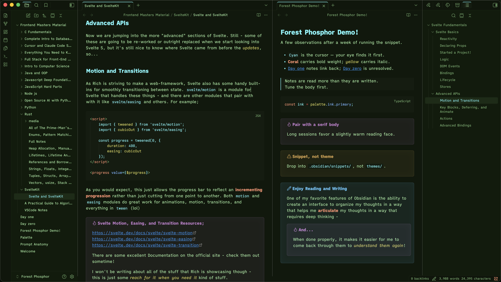

# Forest Phosphor

A modern CRT phosphor monitor theme for Obsidian.

Saturated cyan, amber, and green glowing on dark glass — built around three classic phosphor types (P1 green, P3 amber, P11/P22 blue) layered over a deep forest substrate. Modern legibility, distinct accent contrast, and a glossy callout treatment that suggests phosphor bloom on glass.

Part of the [Forest Phosphor](https://forestphosphor.dev) family — a coordinated palette across Obsidian, VSCode, and iTerm2.

## Install

**From the community gallery:**
Settings → Appearance → Manage themes → Browse → search "Forest Phosphor"

**Manual install:**

1. Download `theme.css` and `manifest.json` from the [latest release](https://github.com/Steven-Theuerl/forest-phosphor-obsidian/releases/latest)
2. Place them in `<your-vault>/.obsidian/themes/Forest Phosphor/`
3. Settings → Appearance → Themes → select Forest Phosphor

## On modes

Forest Phosphor is dark-only by design. The aesthetic — phosphor glow on dark glass — depends on saturated highlights against a deep substrate; a paper variant would dilute the identity past the point of being the same theme.

The CSS handles light mode gracefully: both `.theme-light` and `.theme-dark` resolve to the same palette, so if you have system auto-toggle on, the toggle is just a no-op rather than a broken render.

## Tested with

Confirmed clean rendering with: Daily Notes, Templates, Tasks, Calendar, Outliner, Style Settings. Most well-behaved community plugins should compose fine since Forest Phosphor uses Obsidian's standard CSS variables. If you find one that breaks, open an issue.

## Customization

The theme exposes the standard Obsidian variables, so a snippet in `.obsidian/snippets/` can override any single value without forking. For example, to make the callout glow more pronounced:

​`css
.callout {
  box-shadow: inset 0 0 32px rgba(var(--callout-color), 0.08);
}
​`

It also composes with the [Style Settings](https://github.com/mgmeyers/obsidian-style-settings) plugin if you'd rather tweak via UI.

## Family

- **Obsidian** — this theme
- **VSCode** — [forest-phosphor-vscode](https://github.com/Steven-Theuerl/forest-phosphor-vscode)
- **iTerm2** — [forest-phosphor-iterm2](https://github.com/Steven-Theuerl/forest-phosphor-iterm2)

All three share the same hex values; switch between apps without losing the look.

## Reporting issues

If you find an unstyled element or a plugin that doesn't render right, open an issue with a screenshot and the plugin name. Themes have long tails; user reports are how those gaps get found.

## About

Built by Steven Theuerl (August) ([@Steven-Theuerl](https://github.com/Steven-Theuerl)). The full design system lives at [forestphosphor.dev](https://forestphosphor.dev). Palette reference: traditional CRT phosphor types P1 (green), P3 (amber), P11/P22 (blue).

<!-- If you find Forest Phosphor useful and want to support continued work: [Buy me a coffee](https://buymeacoffee.com/your-handle) -->

## License

MIT — see [LICENSE](./LICENSE).
