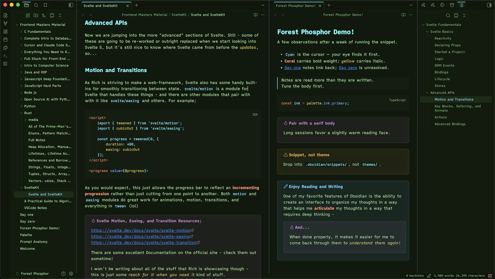

# Forest Phosphor

A modern CRT phosphor monitor theme for Obsidian.

Forest Phosphor evokes the look of an old phosphor terminal — saturated cyan, amber, and green glowing on dark glass — but with modern legibility and accent contrast. Built around three classic phosphor colors (P1 green, P3 amber, P11 blue/cyan) layered over a deep forest substrate.

## On modes

Forest Phosphor is a dark theme. The aesthetic — phosphor glow on dark glass — depends on saturated highlights against a deep substrate, and a paper variant would dilute the identity. Both Obsidian's light and dark mode resolve to the same Forest Phosphor palette, so you get the intended look regardless of the appearance setting and system auto-toggle just no-ops. The submission declares both modes for compatibility.

## Install

**From the community gallery (once published):**
Settings → Appearance → Manage themes → Browse → search "Forest Phosphor"

**Manual Installation:**

1. Download `ForestPhosphor.css` and `manifest.json` from the latest release.
2. Place them in `<your-vault>/.obsidian/themes/Forest Phosphor/`.
3. Settings → Appearance → Themes → select Forest Phosphor.

## Companion themes

Forest Phosphor exists as a coordinated set across the developer stack:

- **VSCode** — `Forest Phosphor` on the marketplace.
- **iTerm2** — color preset on the same palette.

The Obsidian, VSCode, and iTerm palettes share the same color values.

## Customization

The theme uses Obsidian's standard CSS variables, so it composes cleanly with the [Style Settings](https://github.com/mgmeyers/obsidian-style-settings) plugin and any well-behaved snippet. To override any color, drop a snippet in `.obsidian/snippets/` redefining the relevant variable.

## License

MIT — see `LICENSE`.

## Credits

Theme by Steven Theuerl (August). Palette reference: traditional CRT phosphor types P1 (green), P3 (amber), P11/P22 (blue).
